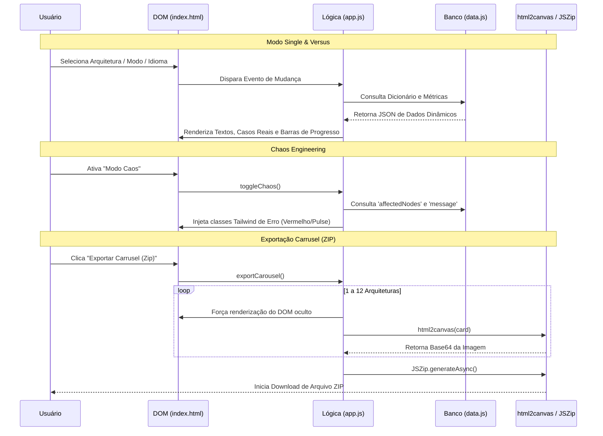

# 📋 Relatório de Entrega — Generador de Infografía de Arquitectura

**Sessão:** `f3b19c2a-8d7e-4b91-a6f2-3e4d5c6b7a8f`
**Data:** 17 de Junho de 2026
**Responsável técnico:** Antigravity (L7 Architect)

---

### 🎯 Objetivo Geral

Modularizar, escalar e implementar as *4 Killer Features* no aplicativo de geração de infográficos, transformando-o em uma plataforma de material didático multimodal para ensino de 12 padrões de arquitetura de software.

| Req. | Descrição |
| :--- | :--- |
| **REQ-01** | Refatoração arquitetural (Separação de HTML, CSS e JS Modular). |
| **REQ-02** | Implementação do "Chaos Engineering Simulator" (Simulação visual de falhas por padrão). |
| **REQ-03** | Motor de Exportação em Lote via arquivo `.zip` (Geração automática de Carrusel das 12 imagens). |
| **REQ-04** | "Versus Mode" (Modo Comparativo): Layout Split-Screen para comparar 2 arquiteturas lado a lado. |
| **REQ-05** | Integração de Casos de Uso Reais e Seção Explicativa ("Analógica e didática") em ES e PT-BR. |

---

### 📁 Arquivos Envolvidos

#### 🟢 CRIADOS

| Arquivo | Descrição |
| :--- | :--- |
| `file:///home/rajesh/Documents/generador_infografia/css/styles.css` | Extração e padronização do design system, animações de neon (`animate-pulse`) e estados do Chaos Mode. |
| `file:///home/rajesh/Documents/generador_infografia/js/data.js` | Banco de dados estático e centralizado (Dicionário multi-idioma, configurações de falha, métricas de complexidade e casos reais de empresas). |
| `file:///home/rajesh/Documents/generador_infografia/js/app.js` | Camada de lógica principal: Controle de DOM, renderização do Modo Versus, injeção dinâmica de UI e lógica de exportação (html2canvas + JSZip). |

#### 🔴 MODIFICADOS

| Arquivo | Descrição |
| :--- | :--- |
| `file:///home/rajesh/Documents/generador_infografia/index.html` | Integração do Tailwind via CDN e libs (`JSZip`, `FileSaver.js`). Criação do layout dinâmico dual (Single Card vs Versus Card) e Seção Explicativa. |

---

### 🏗️ Arquitetura — Fluxo Final

---

### 🔐 Segurança & ✅ Verificação

| Risco / Requisito | Medida Mitigatória / Solução | Status |
| :--- | :--- | :---: |
| **XSS (Cross-Site Scripting)** | Todos os dados textuais nos badges e painéis de explicação são geridos via `innerText` ou `innerHTML` estritamente controlados pelo JSON validado. Não há input livre de usuários salvos. | ✅ |
| **Memory Leaks na Exportação** | Uso de Promises assíncronas com `await` durante o loop do `html2canvas` para liberar a thread do navegador e evitar que o tab congele. | ✅ |
| **Performance (DOM Repaints)** | A reatividade no modo Versus altera apenas a largura (`style.width`) nas barras e textos alvo, sem recriar nós do DOM desnecessários. | ✅ |
| **Estabilidade Local** | Operações de Blob e Canvas funcionam perfeitamente através de Localhost HTTP sem violações severas de CORS na leitura das fontes do Google. | ✅ |

---

> [!NOTE]
> **Configuração Pós-Entrega:**
> Como não há um backend tradicional (Node/PHP/Python), para fazer o deploy deste projeto basta subir os arquivos para serviços estáticos e gratuitos como **GitHub Pages, Vercel ou Cloudflare Pages**. 

> [!WARNING]
> **Extensibilidade Futura:**
> Caso o arquivo `data.js` cresça excessivamente com a adição de novas arquiteturas ou idiomas, o próximo passo arquitetônico natural será migrar esse dicionário estático para uma base headless (como Strapi) ou separar os arquivos JSON e carregá-los via API `fetch()`.
